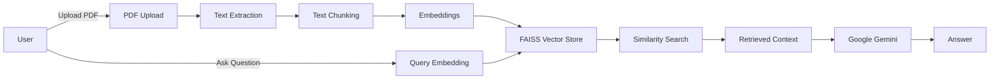
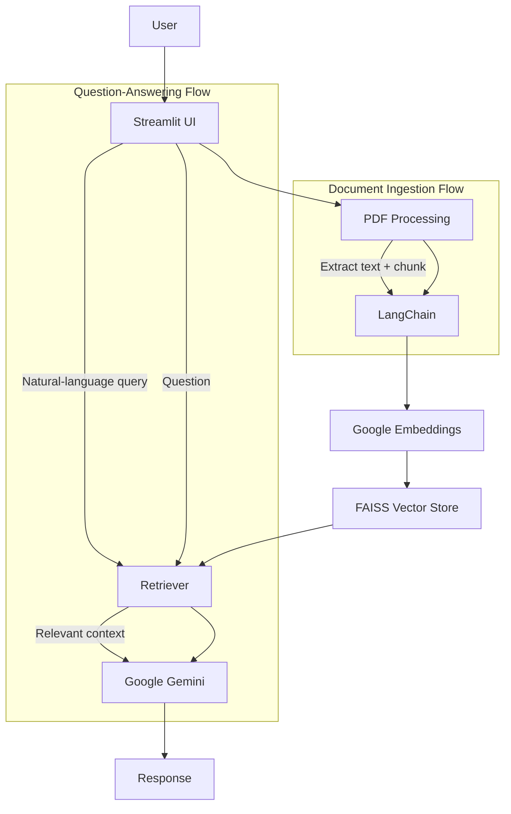

# 📄 PDF Chatbot

A RAG-powered conversational PDF question-answering application that lets users upload PDFs and ask natural-language questions about their content.


## 🚀 Overview

This project is a lightweight Retrieval-Augmented Generation (RAG) application built with Python and Streamlit. It allows a user to upload one or more PDF files, extract the text, split it into meaningful sections, convert those sections into embeddings, and then search for the most relevant content when a question is asked.

The application was built to make private or document-specific information easier to query without requiring the entire document to be passed to the LLM every time. Instead, the system retrieves the most relevant chunks, injects them as context, and then asks Google Gemini to answer using that context. This is especially useful for resumes, reports, research notes, manuals, and other materials that are too large or too specific to search manually.

Users interact with the app through a simple chat interface: upload PDFs, ask a question, and receive a context-aware response grounded in the uploaded document content.

## ✨ Features

- Multiple PDF upload support
- Automatic PDF text extraction using PyPDF2
- Intelligent text chunking with recursive splitting
- Semantic search via embeddings
- Vector embeddings generated with Google Generative AI Embeddings
- FAISS-powered similarity search
- Context-aware question answering with Google Gemini
- Conversational chat interface built with Streamlit
- Environment-variable based API key management using python-dotenv
- Relevant document chunk retrieval before answer generation

## 🧠 How RAG Works

RAG combines retrieval and generation. Instead of sending the entire PDF to the language model, the system first finds the most relevant sections of the document and then gives that context to the model. This helps the model answer questions using document-specific information while keeping the prompt focused and relevant.



### Pipeline steps

- Document ingestion: PDF files are uploaded and read page by page.
- Chunking: long text is split into smaller overlapping chunks to preserve context around relevant information.
- Embedding generation: each chunk is converted into a vector representation using Google Generative AI Embeddings.
- Vector storage: FAISS stores the generated vectors for efficient retrieval.
- Query embedding: the user question is also converted into an embedding.
- Similarity search: FAISS finds chunks whose vectors are most similar to the query.
- Context injection: the retrieved chunks are passed into the prompt as contextual evidence.
- LLM response generation: Google Gemini answers the question using the retrieved context.

## 🏗️ System Architecture



This architecture separates document ingestion from question answering so that only relevant content is used to generate a response.

## 🛠️ Tech Stack

| Technology | Purpose |
| --- | --- |
| Python | Application development |
| Streamlit | Web interface and chat UI |
| LangChain | LLM/RAG orchestration |
| Google Gemini | Answer generation |
| Google Generative AI Embeddings | Text embeddings |
| FAISS | Vector similarity search |
| PyPDF2 | PDF text extraction |
| python-dotenv | Environment configuration |

## 📁 Project Structure

```text
PDF_CHAT_BOT/
│
├── app.py
├── requirements.txt
├── README.md
├── .gitignore
├── faiss_index/
│   └── index.faiss
├── venv/
├── .env
└── screenshots/
    └── chatbot-interface.png
```

### Key files

- `app.py`: Main Streamlit application logic, PDF ingestion, chunking, embedding, retrieval, and generative QA flow.
- `requirements.txt`: Python dependencies required to run the project.
- `faiss_index/`: Local FAISS vector store directory generated by the app.
- `.gitignore`: Ignores local environment artifacts and generated folders.
- `README.md`: Project overview, setup, usage, and documentation.
- `.env`: Local environment file for the Google API key (not committed to GitHub).

## ⚙️ Installation & Setup

### 1. Clone the repository

```bash
git clone <repository-url>
cd PDF_CHAT_BOT
```

### 2. Create a virtual environment

```bash
python -m venv venv
```

#### Activate the environment

macOS/Linux:

```bash
source venv/bin/activate
```

Windows:

```bash
venv\Scripts\activate
```

### 3. Install dependencies

```bash
pip install -r requirements.txt
```

### 4. Configure environment variables

Create a `.env` file in the project root and add your Google API key:

```env
GOOGLE_API_KEY=your_google_api_key
```

> Never commit `.env` files to GitHub. API keys should remain local and private.

### 5. Run the application

```bash
streamlit run app.py
```

## 🔑 Google Gemini API Setup

To use the application, obtain a Google Gemini API key from the Google AI Studio or Google AI Developer portal.

Once you have the key:

1. Create a `.env` file in the project root.
2. Add your key as `GOOGLE_API_KEY`.
3. Ensure the value is kept private and is not exposed in source control or screenshots.

Do not include a real API key in this README or any repository files.

## 💬 Usage

1. Launch the application with Streamlit.
2. Upload one or more PDF files.
3. Wait for the app to process the uploaded documents.
4. Ask a question about the content of the PDFs.
5. Review the answer generated from the retrieved context.
6. Continue asking follow-up questions as needed.

### Example questions

- "What are the main topics discussed in the document?"
- "Summarize the key findings."
- "What technical skills are mentioned in the document?"

## 📊 Example RAG Flow

**Document:** Resume.pdf

**Question:** "What technical skills are mentioned?"

**Retrieved Context:** Relevant sections of the resume containing technical skills and project experience.

**Generated Answer:** A concise answer summarizing the technical skills referenced in the retrieved document context.

This demonstrates the core idea of RAG: the model answers based on the most relevant document content rather than guessing from general knowledge alone.

## 🔐 Security

This project handles API keys and uploaded documents, so the following precautions are important:

- Never commit `.env` to version control.
- Never expose API keys in public code or screenshots.
- Add `.env` to `.gitignore`.
- Avoid logging sensitive document contents.
- Be careful when uploading confidential or proprietary PDFs.
- Do not hardcode credentials in source files.

## ⚡ Performance Considerations

The application is designed to be efficient, but several design choices affect retrieval quality and performance:

- Chunk size matters: smaller chunks improve precision for targeted retrieval, while very large chunks may dilute relevant context.
- Chunk overlap matters: overlapping text helps maintain continuity across chunk boundaries.
- Vector search is faster than repeatedly sending the entire PDF to the LLM, especially for large documents.
- FAISS improves retrieval efficiency by indexing embeddings for quick similarity lookup.
- Only the most relevant chunks are sent to the model, reducing prompt size and improving answer relevance.

No benchmark numbers are claimed here, as this project does not publish measured performance metrics.

## 🧪 Error Handling

The current implementation checks for a valid API key and uploaded PDFs before processing, but it does not include a large custom error-handling layer for every possible failure mode. Realistic issues that may arise include:

- Invalid or corrupted PDFs
- Missing API key
- API errors from the Gemini service
- Unsupported or malformed files
- Embedding generation failures
- Empty PDF content

The app currently relies on the underlying libraries and Streamlit warnings for user feedback, rather than a fully custom exception-handling system.

## 🔮 Future Improvements

The following are realistic planned or potential enhancements for future iterations of the project:

- Persistent vector database storage
- Source and page citations in answers
- Streaming responses from the model
- Conversation memory across turns
- OCR support for scanned PDFs
- Authentication and user management
- Document management and history
- Hybrid semantic + keyword search
- Metadata filtering by document or section
- Docker deployment
- Cloud deployment options
- Improved error handling and validation
- Support for additional document formats

## 📸 Screenshots

Add screenshots of the interface here as the project evolves:

```markdown

```

## 📈 Learning Outcomes

This project demonstrates key concepts relevant to modern AI application development:

- Retrieval-Augmented Generation (RAG)
- Vector embeddings and semantic search
- Vector database workflows with FAISS
- LLM integration with Google Gemini
- LangChain pipeline orchestration
- API integration and environment configuration
- Prompt design and context injection
- Streamlit application development for AI tools

## 🤝 Contributing

Contributions are welcome. If you would like to improve the project:

1. Fork the repository.
2. Create a feature branch.
3. Make your changes.
4. Run the relevant checks locally.
5. Open a pull request with a clear description of the improvement.

Please keep changes focused and ensure the implementation remains consistent with the project’s current architecture.

## 📄 License

This repository does not currently include a license file. Before publishing publicly, choose an appropriate license for the project, such as MIT, and add the corresponding `LICENSE` file. The license should be selected by the repository owner.

## 👨‍💻 Author

- GitHub: [Your GitHub]
- LinkedIn: [Your LinkedIn]
- Email: [Your Email]

---

This project is a practical example of a document-grounded AI application using RAG, embeddings, vector search, and a conversational LLM interface.

